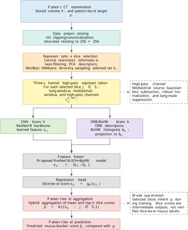

# Automated Grading of Mucus Plugs in Lung CT Scans

Research code and experiment notebooks developed for a 2026 Master's thesis in Data Science at the Norwegian University of Life Sciences (NMBU). The thesis received grade A.

## Overview

This repository documents a weakly supervised, slice-based approach to predicting a patient-level mucus plugging score from chest CT. It preserves the notebook-centric research workflow used in the thesis rather than presenting a production clinical system.

The clinical dataset is **not distributed**. This repository contains no CT volumes, DICOM files, patient identifiers, annotations, labels, fold assignments, trained checkpoints, or patient-level predictions.

## Research problem

The task is patient-level regression from chest CT examinations where only one mucus-burden target is available per examination. The models operate on selected axial slices and do not use slice-level mucus annotations.

## Methodology

<p align="center">
  
</p>

<p align="center">
  <em>Overview of the proposed weakly supervised pipeline for patient-level mucus plug grading from chest CT.</em>
</p>

The final internal configuration uses representative sampling, a three-channel high-pass CT representation, ResNet18, ORB bag-of-visual-words features, feature fusion, and patient-level aggregation. Five-fold patient-level cross-validation was used for internal evaluation. MosMed experiments study transfer and domain shift only; they are not external validation for mucus-burden prediction.

## Repository structure

```text
notebooks/main/      Main thesis experiments
notebooks/archive/   Earlier and alternative thesis experiments
configs/             Configuration guidance; no real paths or credentials
data/                Synthetic manifest schema and access guidance only
docs/                Methodology, data access, and reproducibility notes
```

## Notebook guide

| Notebook | Purpose |
| --- | --- |
| `01_data_preparation_and_baseline.ipynb` | DICOM/HU preparation logic and two-window baseline experiments. |
| `02_three_channel_dct_experiment.ipynb` | DCT-bandpass third-channel comparison. |
| `03_final_resnet18_orb_bovw.ipynb` | Final internal ResNet18 three-channel ORB-BoVW fusion configuration. |
| `04_mosmed_transfer_learning.ipynb` | Mucus-to-MosMed transfer and adaptation experiments. |
| `05_reverse_transfer_mosmed_to_mucus.ipynb` | MosMed-to-mucus transfer and adaptation experiments. |

Archived notebooks preserve legitimate development history and alternative experiments, but are not the recommended starting point.

## Main results

Performance was evaluated at the **patient level** using five-fold cross-validation. The experiments show progressive improvements from representative slice selection, richer CT representations, and feature fusion.

| Experiment | MAE ↓ | RMSE ↓ | R² ↑ | Spearman ρ ↑ |
| --- | ---: | ---: | ---: | ---: |
| Uniform slice sampling | 1.922 | 2.268 | -0.009 | 0.202 |
| Representative slice sampling | 1.760 | 2.223 | 0.003 | 0.306 |
| ResNet18, two-window input | 1.451 ± 0.395 | 1.858 ± 0.434 | 0.126 ± 0.161 | 0.363 ± 0.239 |
| ResNet18, three-channel input | 1.386 ± 0.456 | 1.826 ± 0.394 | 0.186 ± 0.394 | 0.387 ± 0.256 |
| **ResNet18-3CH + ORB-BoVW** | **1.244 ± 0.297** | **1.712 ± 0.505** | **0.236 ± 0.295** | **0.498 ± 0.346** |

The final **ResNet18-3CH + ORB-BoVW** model achieved the strongest internal performance. Combining learned CNN representations with handcrafted ORB-BoVW features reduced MAE by approximately **14%** compared with the two-window ResNet18 configuration.

The thesis also investigated transfer learning between the mucus-plug dataset and the public MosMed CT dataset. These experiments explored **transfer learning and domain shift** and should not be interpreted as external validation of mucus-plug grading.

> **Note:** Results are exploratory due to the small internal cohort (32 patients), weak patient-level supervision, and lack of an independent external dataset with a comparable mucus-plug target.

## Dataset availability

Clinical data and derived data are restricted and are not included. See [data/README.md](data/README.md). The example manifest contains only synthetic records.

## Reproducibility

Install the unpinned research dependencies with:

```bash
python -m pip install -r requirements.txt
```

Then configure paths to authorised data in the configuration cell near the beginning of the relevant notebook. Exact package versions, hardware details, and fully deterministic CUDA execution were not preserved in the original thesis snapshot; see [docs/reproducibility.md](docs/reproducibility.md).


## Citation

Please cite the associated thesis. Citation metadata is available in [CITATION.cff](CITATION.cff).
